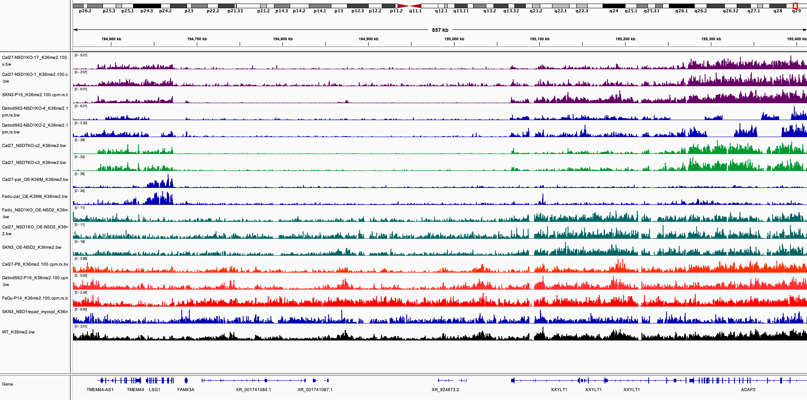
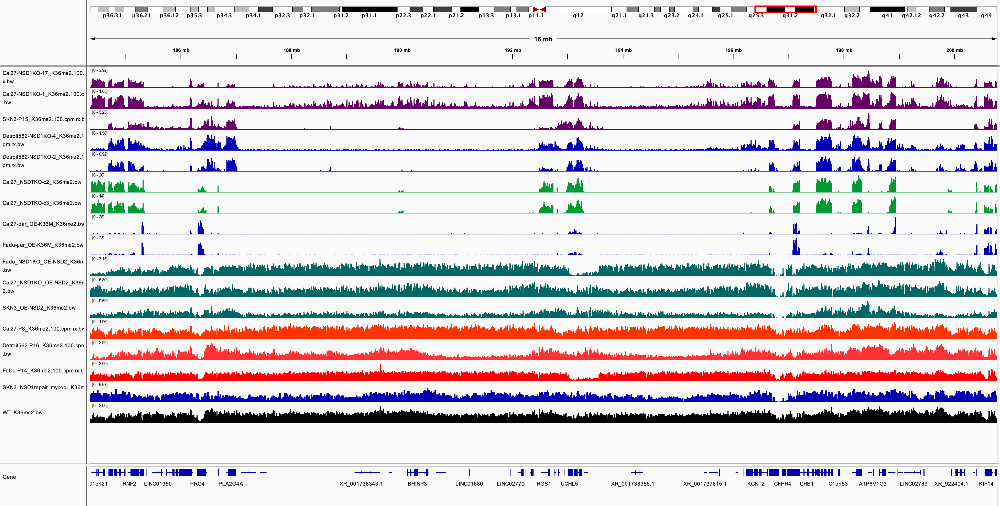

```{r setup, include=FALSE}
knitr::opts_chunk$set(echo = TRUE)
library(reticulate)
library(knitr)
```

# Directories

```{python include = FALSE}
import pandas as pd
df = pd.DataFrame({"Dir" : ["/lustre03/project/6007495/fh4132/projects/HNSCC/chipseq/MAJ1301/out","/lustre03/project/6007495/fh4132/projects/HNSCC/chipseq/hg38/bw2"]})
print(df.to_markdown(index = False))
```

```{r echo = FALSE}
kable(py$df)
```

# Screenshots

## Obv 1

NSD2-OE seems to restore K36me2 in regions that are depleted in the NSD1KO.
```{r echo = FALSE, warning=FALSE,message=FALSE,out.width='100%', dpi = 600,fig.width=12,fig.height=9}
include_graphics(c("images/restored_nsd2oe_1.png"),dpi = 600)

#<p align="center">
  #
#</p>
#<p>&nbsp;</p>
#<p align="center">
 # 
#</p>
```
<p>&nbsp;</p>
```{r echo = FALSE, warning=FALSE,message=FALSE,out.width='100%', dpi = 600,fig.retina=2}
include_graphics("images/restored_nsd2oe_2.png",dpi=600)
```

## Obv 2

However, it seems NSD2-OE also causes spreading of K36me2 into regions that normally has lower levels of K36me2 in parental and WT. 

```{r echo = FALSE, warning=FALSE,message=FALSE,out.width='100%', dpi = 600,fig.retina=2}
include_graphics("images/excess_nsd2oe_2.png",dpi=600)
```
<p>&nbsp;</p>
```{r echo = FALSE, warning=FALSE,message=FALSE,out.width='100%', dpi = 600,fig.retina=2}
include_graphics("images/excess_nsd2oe_4.png",dpi=600)
```

## Obv 3

In other instances, NSD2-OE does not seem to restore K36me2 to the level of parental/WT.

```{r echo = FALSE, warning=FALSE,message=FALSE,out.width='100%', dpi = 600,fig.retina=2}
include_graphics("images/dysfunction_nsd2oe_1.png",dpi=600)
```

# Summary
* NSD2OE indiscriminately restores K36me2 depleted in NSD1KO, but also increases K36me2 in regions that are otherwise not elevated in parental/WT.
* Hypothesis: NSD2OE may cause restoration of K36me2 and unwanted spreading in other regions but does not necessarily elevate K36me2 in a given region to the extent as parental/WT. 
* Repairing NSD1 (in SKN3-repair) appears to have the highest fidelity in terms of restoring a “normal” H3K36me2 landscape as we find some regions remaining depleted of H3K36me2 as opposed to indiscriminate, uniform gain that was seen for NSD2-OE.
* SKN3_NSD1_repair seems to "normally" restore the H3K36me2 landscape, yet have similar ChIP-Rx values to NSD2.OE.

# Future directions
* Quantify the enrichment (per cent input) of H3K36me2 at various intergenic regions in parental versus NSD2OE via ChIP–qPCR.
* Generate density plots of H3K36me2 levels at intergenic, exonic and intronic regions for parental and NSD2OE.
* Quantify CpG methylation in intergenic regions in NSD2OE to determine if CpG methylation is similar to levels in parental or wildtype NSD1.